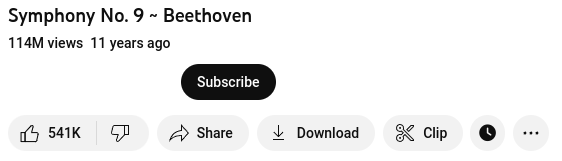
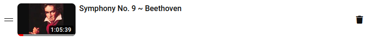

# YT Quick Actions

YT Quick Actions is a web extension for YouTube making actions related to watch later playlist management quicker
to access.

Concretely, YT Quick Actions offers the following features:

- Add a remove button in playlists next to the more options button
- Add a watch later button as an action under videos
- Add a watch later button as an action in home page videos
- Add a remove button for playlists being watched

## Changelog

Version changes can be found here: [CHANGELOG.md](./CHANGELOG.md)

## Installation

- Firefox
  - From addons.mozilla.org: [AMO](https://addons.mozilla.org/en-US/firefox/addon/yt-quick-actions/)
  - From release page (manual): [Releases](https://github.com/Compile-Time/yt-quick-actions/releases)
- Google Chrome
  - From Chrome Web Store:
    [chrome web store](https://chrome.google.com/webstore/detail/yt-quick-actions/lopaoogidddnpogjngfhbaklhdecmcii)

## Permissions

The following permissions are required for the extension to work:

- Firefox
  - Host: `https://www.youtube.com/*`
    <br>Modify the YouTube web page to add custom elements and access the URL from YouTube tabs.
  - storage
    <br>Store extension settings in browser storage.
- Chrome
  - Host: `https://www.youtube.com/*`
    <br>Modify the YouTube web page to add custom elements.
  - storage
    <br>Store extension settings in browser storage.
  - tabs
    <br>Access the URL from YouTube tabs

## Screenshots

### Watch later button for home page video


### Watch later button under playing video



### Remove button in watch later playlist



### Remove button in currently playing playlist


## Building

To build an unsigned extension for development testing, with or without hot
module reloading (HMR), run one of the `start` scripts mentioned below.

```sh
# Firefox
npm run start
npm run start-no-hmr

# Chrome
npm run start-ch
npm run start-no-hmr-ch
```

These script will produce the following directories under the `dist` directory
respectively:

- `/dist/firefox-dev`
- `/dist/chrome-dev`

For production builds that can be zipped for upload to [AMO](https://addons.mozilla.org/en-US/firefox/) or the
[Chrome web store](https://chrome.google.com/webstore/category/extensions) use the `build` scripts.

```sh
# Firefox
npm run build

# Chrome
npm run build-ch
```

The production builds can also be found under `/dist`:

- `/dist/firefox-prod`
- `/dist/chrome-prod`
