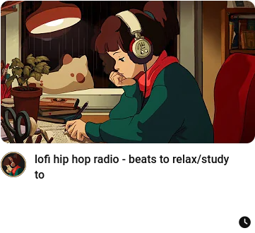

# YT-Quick-Actions

YT-Quick-Actions is a web extension for YouTube making actions related to playlist management quicker
to access.

Concretely, YT-Quick-Actions offers the following features:

- Add a remove button in playlists next to the more options button
- Add a watch later button as an action under videos
- Add a watch later button as an action in home page videos
- Add a remove button for playlists being watched

## Permissions

The following permissions are required for the extension to work:

- Firefox
    - Host: https://www.youtube.com/*
       Modify the YouTube web page to add custom elements and access the URL from YouTube tabs.
    - storage
       Store extension settings in browser storage.
- Chrome
    - Host: https://www.youtube.com/*
       Modify the YouTube web page to add custom elements.
    - storage
       Store extension settings in browser storage.
    - tabs
       Access the URL from YouTube tabs

## Screenshots

### Watch later button for home page video

### Watch later button under playing video

### Remove button in watch later playlist

